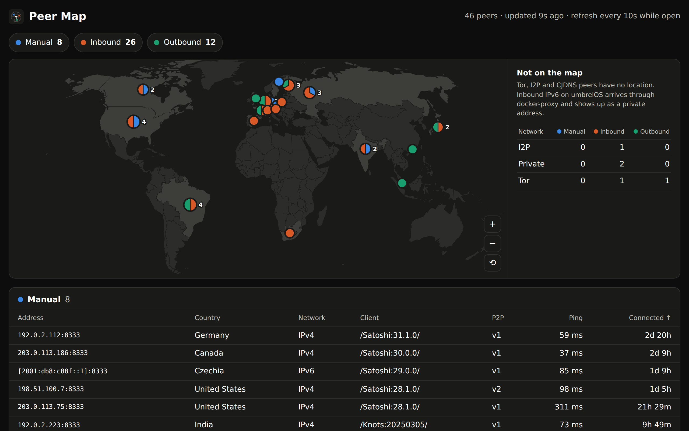
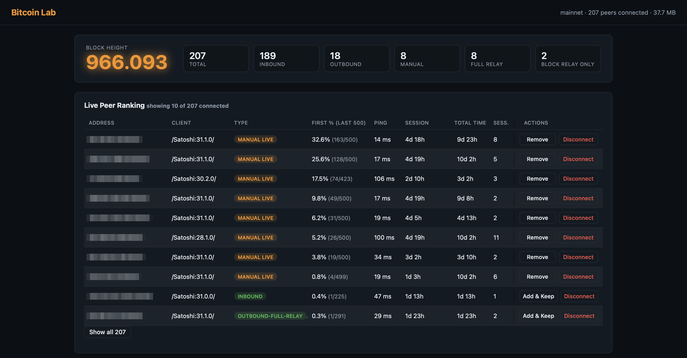

# Bitcoin Peer Lab

**See who your Bitcoin node connects to. Find the peers that bring blocks first.**

Two apps for Umbrel, built for enthusiasts who enjoy running their own node and getting more out of it. Explore your connections, discover which peers deliver first and build a set worth keeping.

| App | What it helps you do |
|---|---|
| [Peer Map](https://github.com/benunskilled/peer-map) | See your peers' locations, hosting providers, software and services |
| [Bitcoin Lab](https://github.com/benunskilled/bitcoin-lab) | Find out which peers deliver blocks first and keep the strongest connections. |

If you're also into solo mining at home, Bitcoin Lab's optional Stratum Race lets you compare your own pool with public solo pools.

Use either app on its own or both together. Each requires Umbrel's official **Bitcoin Node** app.

## Peer Map: understand your connections

Put your live peers on a world map, zoom into regions and see their hosting providers, software and services. Manual, outbound and inbound connections have their own tables, making it easy to see how each group is distributed.

Discover details a connection count cannot show: peers across several countries sharing one provider, the mix of nodes, wallets and crawlers, and connections over Tor and I2P listed beside the map.

All map and lookup data is bundled locally. No peer address is sent to an external lookup service, and the dashboard pauses updates when you're no longer viewing it.



## Bitcoin Lab: find the connections worth keeping

See which peers deliver new blocks first and use their track record to choose who stays. Manage your selection yourself, or enable rotation to keep proven peers and find stronger candidates among Core's outbound connections automatically. Inbound connections are left alone, and peers you protect stay protected.

If you run your own solo-mining pool, optional Stratum Race shows how its new mining jobs arrive compared with public pools, so you can follow its performance as you improve your setup.

Peer rotation and Stratum Race are both off on a fresh install. Enable either when you want to explore it. Bitcoin Lab also includes a summary widget for Umbrel's home screen.



## Install

1. In umbrelOS, open **Settings → App Store → ⋮ → Community App Stores**.
2. Add this store URL:

   ```text
   https://github.com/benunskilled/bitcoin-lab-community-store
   ```

3. Install **Peer Map**, **Bitcoin Lab**, or both. Umbrel will offer to install Bitcoin Node first if needed.

Open the apps from Umbrel, or use their dashboard addresses:

| App | Dashboard |
|---|---|
| Bitcoin Lab | `<your-umbrel>:8790` |
| Peer Map | `<your-umbrel>:8791` |

Let Bitcoin Lab collect observations as blocks arrive, then see which peers are earning their place. There is no need to enable rotation to explore the results. Add Peer Map if you want to learn more about those connections and see how they are distributed across regions and providers.

## Source and documentation

This repository contains the Umbrel packaging. Application code and detailed documentation live in the individual repositories:

- [Bitcoin Lab](https://github.com/benunskilled/bitcoin-lab)
- [Peer Map](https://github.com/benunskilled/peer-map)

For packaging and publishing instructions, see [RELEASING.md](RELEASING.md).
