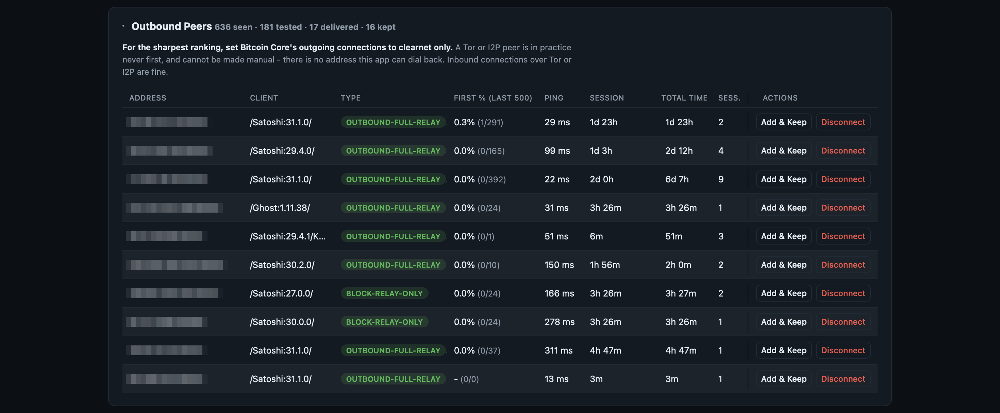

# Bitcoin Lab — Umbrel Community App Store

**Bitcoin Lab** turns curating your Bitcoin Core node's peers into a measurable
speed improvement, and Stratum Race is how you see whether it's actually
working.



## What it does

- **Peer relay ranking** — continuously tracks which of your connected peers
  actually deliver new blocks first, over Bitcoin Core's ZMQ interface, building
  a long-term First / Eligible / First % ranking per peer (plus ping, session
  count, total connection time). **This is where most of the actual speed gain
  comes from**: add your best-ranked peers as manual/trusted connections so
  they stay connected instead of rotating out on their own, and disconnect
  outbound peers that never deliver anything — Core replaces a disconnected
  outbound with a fresh, random one, which you then rank the same way. Repeat
  the loop and your peer set gets better over time instead of staying whatever
  Core happened to pick.
- **Stratum Race** — tracks latency (avg/median/P90) and win rate per mining
  pool, race after race (any local solo pool you add by host/port, plus a
  handful of public solo pools out of the box). **This is the main reason it
  exists**: as your peer curation above pays off and your node relays blocks
  faster, a pool built on that node should get its own new-block template out
  faster too — Stratum Race is how you actually watch that latency improve
  over time, instead of assuming better peers helped. Comparing external pools
  against each other is a secondary, free byproduct of the same measurement.

Both live on the same dashboard, refreshed continuously.

## Installing

1. In Umbrel: **Settings → App Store → ⋮ → Community App Stores**
2. Paste this store's URL:
   ```
   https://github.com/benunskilled/bitcoin-lab-community-store
   ```
3. Open the **Bitcoin Lab** store and install **Bitcoin Lab**. It depends on
   the official **Bitcoin Node** app, which Umbrel will offer to install
   first if you don't already have it.

The dashboard is then reachable at `<your-umbrel>:8788`.

## Repositories

- [`bitcoin-lab`](https://github.com/benunskilled/bitcoin-lab) — the
  application source and the Docker image it publishes.
- `bitcoin-lab-community-store` (this repo) — only the Umbrel packaging
  (`umbrel-app.yml` + `docker-compose.yml`) that tells Umbrel how to install
  and update it.

---

## Maintainer notes (updating a release)

1. Bump `version:` in `bitcoinlab-node/umbrel-app.yml`, write `releaseNotes:`.
2. Tag and push a new version in `bitcoin-lab` (`git tag vX.Y.Z && git push --tags`)
   and wait for the "Build and publish multi-arch image" GitHub Action to
   finish — its last step prints the exact
   `ghcr.io/benunskilled/bitcoin-lab:X.Y.Z@sha256:<digest>` reference.
3. Paste that reference into all four `image:` lines in
   `bitcoinlab-node/docker-compose.yml`.
4. Commit and push this repo. Umbrel shows the update to anyone who has
   already added this store; a store that's never been added before will
   see the current version right away.

A packaging-only change (no new application image) can bump just this repo's
`version:` — the `image:` digests stay pointed at whatever release is
current.
