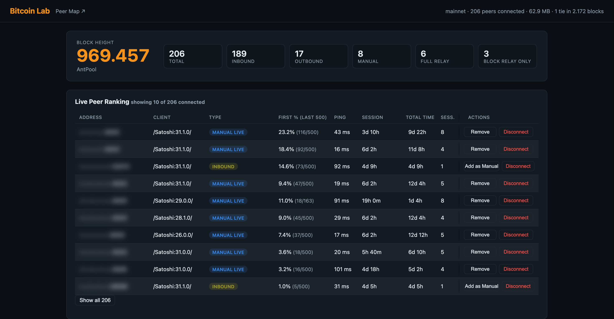
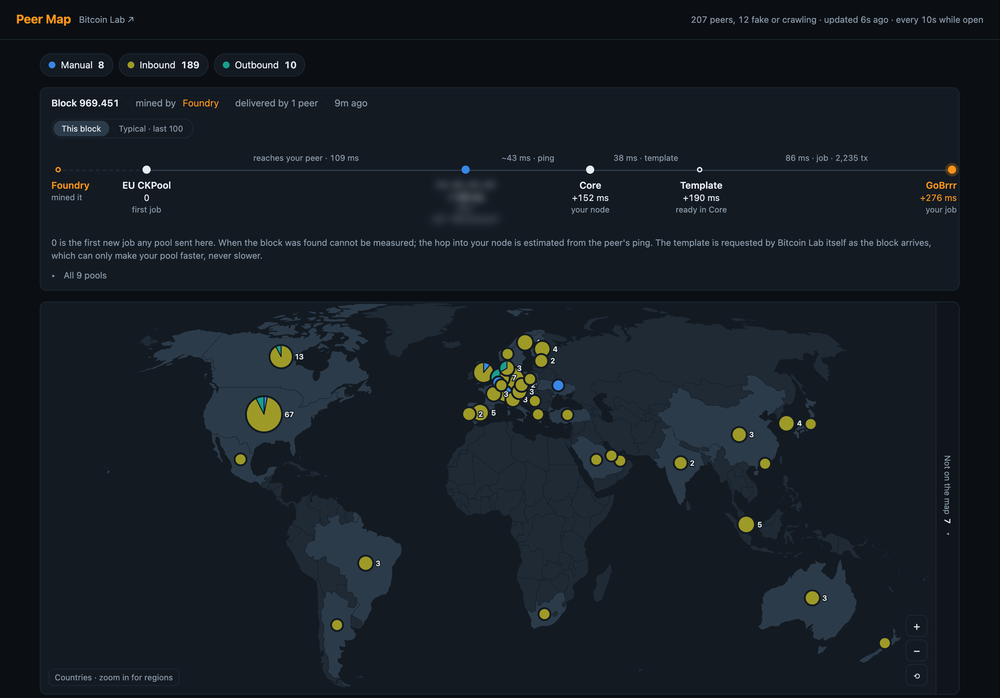

# Bitcoin Peer Lab

**Ever wondered which of your peers actually brings you new blocks first?**

Two apps for Umbrel that show you. Bitcoin Lab notes for every new block which peer delivered it first and ranks your peers by it. Peer Map shows where those peers are, who runs them and what they are: real nodes, pool nodes, wallets, crawlers or scanners.

| App | What it helps you do |
|---|---|
| [Bitcoin Lab](https://github.com/benunskilled/bitcoin-lab) | See which peers deliver new blocks first, measured on your own node |
| [Peer Map](https://github.com/benunskilled/peer-map) | See your peers' locations, hosting providers, software and services |

If you're also into solo mining at home, Bitcoin Lab's optional Stratum Race lets you compare your own pool with public solo pools. Peer Map then takes each new block apart step by step: when your peer had it, when Core accepted it, when the block template was ready and when your pool sent the new job, so you can see where your setup loses time.

Use either app on its own or both together. Each requires Umbrel's official **Bitcoin Node** app.

## Bitcoin Lab: see who delivers first

Over days the first deliveries add up to a ranking of your peers, built from your node's own measurements.

If you want to act on it, you can keep proven peers as manual peers yourself, or enable rotation to do it automatically among Core's outbound connections. Inbound connections are left alone, and peers you protect stay protected.

Running your own solo pool? Stratum Race lets you track how its job times change as you improve your setup.

Peer rotation and Stratum Race are both off on a fresh install. Let Bitcoin Lab just measure for a day or so first: you'll see who delivers blocks to your node as it is, so you can better judge improvements later. Bitcoin Lab also includes a summary widget for Umbrel's home screen.



## Peer Map: understand your connections

Put your live peers on a world map and see their hosting providers, software and services. Manual, outbound and inbound connections have their own tables, and at a glance you see whether your peers really are spread out – across countries and across providers.

All map and lookup data is bundled locally. No peer address is sent to an external lookup service, and the dashboard pauses updates when you're no longer viewing it.



**No open port? Both apps still work.** Without port 8333 open to the internet, your node only has the roughly ten connections it opens itself, plus whatever reaches it over Tor or I2P. Peer Map then has fewer peers to show. Bitcoin Lab works as usual – and matters even more here: its eight manual slots nearly double your node's connections, filled with the peers that delivered best.

## Install

1. In umbrelOS, open **App Store → ⋮ → Community App Stores**.
2. Add this store URL:

   ```text
   https://github.com/benunskilled/bitcoin-lab-community-store
   ```

3. Install **Bitcoin Lab**, **Peer Map**, or both. Umbrel will offer to install Bitcoin Node first if needed.

Open the apps from Umbrel, or use their dashboard addresses:

| App | Dashboard |
|---|---|
| Bitcoin Lab | `<your-umbrel>:8790` |
| Peer Map | `<your-umbrel>:8791` |

## Source and documentation

This repository contains the Umbrel packaging. Application code and detailed documentation live in the individual repositories:

- [Bitcoin Lab](https://github.com/benunskilled/bitcoin-lab)
- [Peer Map](https://github.com/benunskilled/peer-map)

For packaging and publishing instructions, see [RELEASING.md](RELEASING.md).
